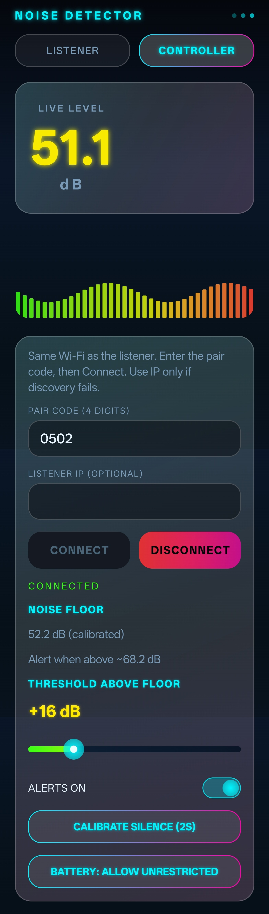
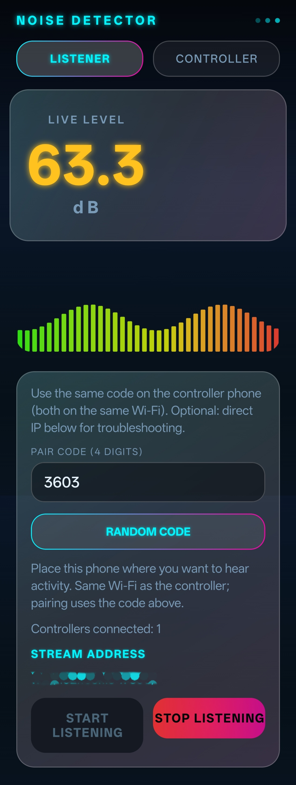
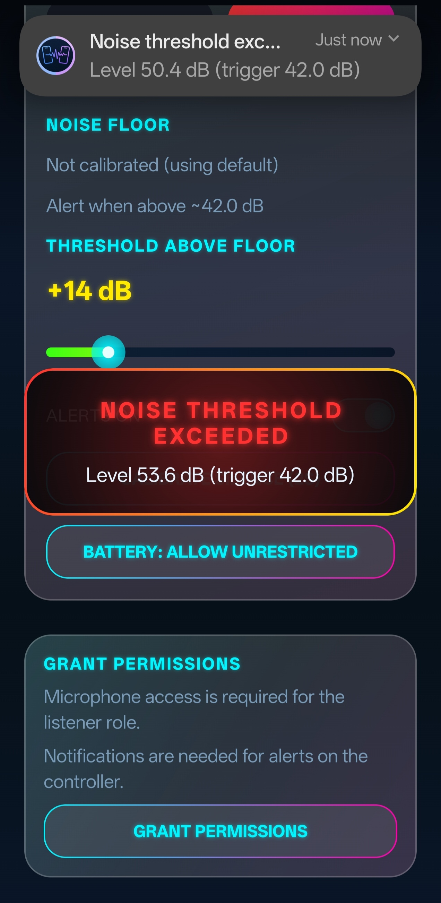

# Noise-Detector
Noise Detector is a real-time sound monitoring app that lets you detect noise levels remotely and receive instant alerts.  Place one phone near a room to monitor sound activity, and use another phone to track live audio levels over the same WiFi network.  
# 🔊 Noise Detector

Real-time sound detection with remote alerts across devices.

  
  
  

## 🚀 Features

* 📡 Real-time sound monitoring
* 📱 Works across two devices on same WiFi
* 🔔 Instant alerts when noise exceeds threshold
* 📳 Vibration + notification support
* 🌙 Works in background and lock screen
* 🎚️ Adjustable sensitivity
* 🔐 No data collection, fully private

---

## 📥 Download

[Download APK](https://github.com/Barath702/Noise-Detector/releases/tag/v1.0)

---

## 📱 How It Works

1. Install app on two devices
2. Use one as **Listener** (near sound source)
3. Use another as **Receiver**
4. Get alerts when sound exceeds threshold

---

## ⚙️ Installation

1. Download APK
2. Enable "Install unknown apps"
3. Install and open

---

## 🔐 Privacy

This app does not collect, store, or share any personal data.
Microphone is used only for real-time sound detection only.

---

## 🛠️ Built With

* Android (Kotlin)
* WebSocket communication
* Jetpack Compose UI

---

## ⭐ About

Noise Detector is designed as a simple, private, and reliable sound monitoring tool.
